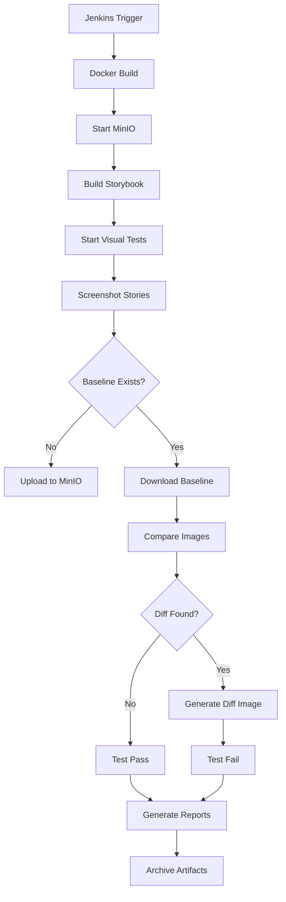

# 🐳 Docker Visual Testing Guide

## Complete Dockerized Solution with MinIO Integration

Your visual testing framework is now fully containerized and ready for production deployment!

## 🚀 Quick Start

### 1. **Prerequisites**
- Docker & Docker Compose installed
- Your existing Jenkins with `minio-creds` credential

### 2. **Run Complete Stack**
```bash
# Start MinIO + Storybook + Visual Tests
docker-compose --profile testing up --build

# View results at:
# - MinIO Console: http://localhost:9001 (esteban/bobbiesi796)
# - Test Reports: http://localhost:8080
```

### 3. **Development Mode**
```bash
# Development with hot reload
docker-compose -f docker-compose.yml -f docker-compose.override.yml --profile development up

# Access:
# - Development Storybook: http://localhost:6007
# - Development Reports: http://localhost:8081
```

## 📦 **Docker Architecture**

### **Services Overview**
```yaml
┌─────────────────┐    ┌──────────────────┐    ┌─────────────────┐
│     MinIO       │    │   Storybook      │    │ Visual Tests    │
│  (Storage)      │◄───┤   (UI Server)    │◄───┤ (Playwright)    │
│  Port: 9000/1   │    │   Port: 6006     │    │ (Test Runner)   │
└─────────────────┘    └──────────────────┘    └─────────────────┘
         │                        │                        │
         ▼                        ▼                        ▼
┌─────────────────┐    ┌──────────────────┐    ┌─────────────────┐
│ Persistent Vol  │    │ Build Artifacts  │    │ Test Results    │
│ (minio_data)    │    │ (storybook-static)│   │ (reports/logs)  │
└─────────────────┘    └──────────────────┘    └─────────────────┘
```

### **Container Details**

#### **MinIO Container**
- **Image**: `minio/minio:latest`
- **Ports**: `9000:9000` (API), `9001:9001` (Console)
- **Credentials**: `esteban/bobbiesi796` (your existing setup)
- **Storage**: Persistent volume for baseline images
- **Health Check**: Built-in MinIO health endpoint

#### **Storybook Container**  
- **Image**: Custom Node.js 18 with Playwright
- **Purpose**: Serves static Storybook build
- **Port**: `6006:6006`
- **Dependencies**: Waits for MinIO to be healthy

#### **Visual Tests Container**
- **Image**: Same as Storybook (shared Dockerfile)
- **Purpose**: Runs Playwright visual tests
- **Environment**: CI mode with full browser suite
- **Storage**: Connects to MinIO for baselines
- **Output**: Generates Allure and Playwright reports

#### **Reports Container**
- **Image**: `nginx:alpine`
- **Purpose**: Serves test reports via web interface
- **Port**: `8080:80`
- **Content**: Allure reports, screenshots, diffs

## 🔧 **Jenkins Integration**

### **Your Existing Credential Setup** ✅
```groovy
// Jenkins automatically uses your minio-creds
withCredentials([usernamePassword(credentialsId: 'minio-creds', usernameVariable: 'MINIO_USER', passwordVariable: 'MINIO_PASS')])
```

### **Pipeline Stages**
1. **Checkout**: Source code retrieval
2. **Install Dependencies**: `docker build`
3. **Run Visual Tests**: `docker-compose up` with your credentials
4. **Report Generation**: Automatic Allure report creation
5. **Artifact Archive**: Reports, logs, screenshots

### **Required Jenkins Configuration**
- ✅ **Credential**: `minio-creds` (already configured)
- ✅ **Docker**: Docker daemon accessible to Jenkins agent
- ✅ **Plugins**: HTML Publisher, Allure (optional)

## 💻 **Commands Reference**

### **Production Commands**
```bash
# Full test suite
docker-compose --profile testing up --build --abort-on-container-exit

# Just MinIO + Storybook
docker-compose up minio storybook

# View reports
docker-compose --profile reporting up reports

# Clean up
docker-compose down -v
```

### **Development Commands**
```bash
# Development mode with file watching
docker-compose -f docker-compose.yml -f docker-compose.override.yml --profile development up

# Run specific test
docker-compose exec visual-tests npx playwright test tests/visual/demo-visual-test.spec.ts

# Update baselines
docker-compose exec visual-tests npm run visual-tests:update-baselines

# Access container shell
docker-compose exec visual-tests sh
```

### **Debugging Commands**
```bash
# View logs
docker-compose logs visual-tests
docker-compose logs minio

# Check container status
docker-compose ps

# Inspect networks
docker network ls
docker network inspect visual-testing-network
```

## 🎯 **Key Benefits of Docker Solution**

### **Consistency**
- ✅ **Same Environment**: Identical runtime across dev/CI/prod
- ✅ **Browser Versions**: Locked Playwright browser versions
- ✅ **Dependencies**: Consistent Node.js, system libraries

### **Scalability**  
- ✅ **Parallel Execution**: Multiple test containers
- ✅ **Resource Isolation**: Each service in separate container
- ✅ **Easy Scaling**: `docker-compose up --scale visual-tests=3`

### **Isolation**
- ✅ **Clean State**: Fresh environment for each test run
- ✅ **No Conflicts**: Isolated networks and volumes
- ✅ **Security**: Containerized execution sandbox

### **Deployment**
- ✅ **Jenkins Ready**: Direct integration with your pipeline
- ✅ **Cloud Native**: Works with Kubernetes, Docker Swarm
- ✅ **CI/CD**: Perfect for GitLab CI, GitHub Actions, Azure DevOps

## 🔍 **Visual Testing Workflow**



## 🚀 **Production Deployment**

### **Environment Variables**
```bash
# Production .env
STORAGE_PROVIDER=s3  # Switch to S3 for production
STORAGE_BUCKET=prod-visual-baselines
AWS_REGION=us-east-1
VISUAL_THRESHOLD=0.1  # Stricter for production
```

### **Scaling Configuration**
```bash
# Scale test runners
docker-compose up --scale visual-tests=5

# Resource limits
services:
  visual-tests:
    deploy:
      resources:
        limits:
          cpus: '2.0'
          memory: 4G
```

This Docker solution provides enterprise-grade visual testing with your existing MinIO setup, making it perfect for Disney-scale projects! 🏰